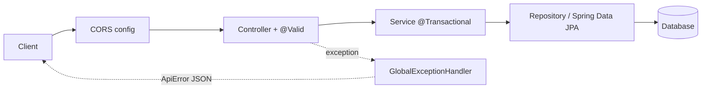

# DeskFlow — Technical Architecture

This document defines the architecture for the DeskFlow Hot Desk Booking API.
It strictly follows the required scope, domain model, and API contracts defined in
[mini-project.md](mini-project.md). No components beyond what is needed to satisfy
that brief (plus the chosen creative feature) are introduced.

## 1. Architecture Style

**Modular Monolith + Layered Architecture.**

Rationale: single Spring Boot app, ~5 hour build window, 4–5 contributors working in
parallel. A layered monolith is the fastest to build, easiest to divide by module
ownership, and the simplest to explain in a 10-minute presentation. Microservices,
API gateways, or message brokers are explicitly rejected as out of scope for this
timebox (see §5).

```
Controller  →  Service (business rules, @Transactional)  →  Repository (Spring Data JPA)  →  DB
```

- **Controller**: request/response shape, HTTP status codes, `@Valid` input binding only.
- **Service**: all business rules (desk active check, conflict check, date rules).
- **Repository**: persistence only, no business logic.
- **DTOs** in, **DTOs** out — JPA entities are never returned directly from a controller.

## 2. Package Structure (feature-first)

Full path (Maven convention): `src/main/java/com/deskflow/...`

```
com.deskflow
├── desk/            Desk entity, repository, service, controller, dto/
├── booking/         Booking entity, repository, service, controller, dto/
├── health/          Health check controller
├── common/          GlobalExceptionHandler, ApiError, custom exceptions
└── config/          CORS/OpenAPI config (acctually not used)
```

One package per domain concept from the brief (`desk`, `booking`) — matches the
prescribed domain model exactly. No speculative packages (e.g. `user`, `auth`) are
added since the brief explicitly excludes authentication.

**Why package-by-feature instead of package-by-layer** (i.e. not
`controller/`, `service/`, `repository/`, `entity/` top-level folders):

1. **Parallel work without file collisions.** Whoever owns `desk` only touches
   files under `desk/`; whoever owns `booking` only touches `booking/`. With
   layer-first packages, two people editing different features would still be
   adding files into the same shared `controller/`/`service/` folders.
2. **High cohesion.** All classes for one business concept
   (`Desk`, `DeskController`, `DeskService`, `DeskRepository`) sit together —
   changing a feature means working in one folder, not jumping across four.
3. **Maps directly to the domain model in the brief** (`desk`, `booking`), so
   the code structure matches how the team talks about the project, including
   during the presentation.
4. **Cleaner to cut scope.** If a feature has to be dropped under time
   pressure, deleting one folder removes it cleanly.

Package-by-layer is a reasonable alternative for a 1–2 person project with a
single entity, but for a 4–5 person team building two distinct modules in
parallel under a 5-hour timebox, package-by-feature is the better fit.

## 3. Domain Model (as prescribed by the brief)

### `desk`
| Field | Type | Constraint |
|---|---|---|
| id | Long | PK |
| code | String | unique, not null |
| floor | int | not null |
| has_monitor | boolean | not null |
| is_active | boolean | not null, default true |

### `booking`
| Field | Type | Constraint |
|---|---|---|
| id | Long | PK |
| desk_id | FK → desk | not null |
| employee_name | String | not null |
| date | LocalDate | not null |
| created_at | Timestamp | set on insert |

**Core rule (enforced twice, see §7):** unique constraint on `(desk_id, date)`.

Seed data: ≥8 desks across ≥2 floors, plus a few sample bookings (per brief).

## 4. Request Flow / Middleware Chain



## 5. Middleware & Framework Components

| Concern | Component | Notes |
|---|---|---|
| Web layer | `spring-boot-starter-web` | Embedded Tomcat, JSON via Jackson |
| Persistence | `spring-boot-starter-data-jpa` (Hibernate) | ORM + `@Transactional` |
| Connection pool | HikariCP (default, no extra config) | Bundled with Spring Boot |
| Validation | `spring-boot-starter-validation` | `@NotBlank`/`@NotNull` on request DTOs |
| Exception handling | `@RestControllerAdvice` | Single place mapping exceptions → status codes |
| Date/time JSON | Jackson `jsr310` module (bundled) | `LocalDate` ⇄ `"YYYY-MM-DD"`, no custom config |
| CORS | `WebMvcConfigurer#addCorsMappings` | Only needed if the optional frontend bonus is built |
| API docs | `springdoc-openapi-starter-webmvc-ui` | Swagger UI for demo, near-zero config |
| DB (dev) | H2 (in-memory) | Fast local iteration, resets each run |
| DB (demo, per brief) | MySQL | Activated via `application-mysql.yml` profile |

**Explicitly not used** (would be over-engineering for this scope/timebox):

| Rejected | Reason |
|---|---|
| Spring Security | Brief excludes authentication |
| Redis / caching | Data volume is tiny (8+ desks); adds config risk for no benefit |
| Kafka / RabbitMQ | If the waitlist/notify creative idea is chosen, an in-memory `Map` simulates it |
| Flyway / Liquibase | Single-run demo app; `schema.sql` + `data.sql` SQL init is sufficient |
| Docker / Compose | Brief marks this as optional stretch only |
| API Gateway | Single monolith, no service-to-service routing needed |

## 6. API Contract

Strictly the 5 required endpoints from the brief, plus one creative endpoint.

| Method & Path | Success | Failure cases |
|---|---|---|
| `GET /api/health` | 200 `{ "status": "ok" }` | — |
| `GET /api/desks?floor=&hasMonitor=` | 200 array of desks | — |
| `POST /api/bookings` | 201 created booking | 404 desk not found · 400 inactive desk / invalid date / blank name · 409 already booked |
| `GET /api/bookings?date=` | 200 array of bookings for date | — |
| `DELETE /api/bookings/{id}` | 204 no content | 404 booking not found |
| **Creative:** `GET /api/desks/available?date=&floor=` | 200 array of free, active desks | 400 invalid/missing date |

Desk response fields (per brief): `id`, `code`, `floor`, `hasMonitor`, `active`.
Booking response includes `deskId` or desk `code` so demo output stays readable.

## 7. Double-Booking Rule — Two-Layer Enforcement

1. **Service layer**: check-before-insert for a clear, fast-fail error path.
2. **Database layer**: unique constraint on `booking(desk_id, date)` as the real
   guarantee under concurrent requests. `DataIntegrityViolationException` is caught
   in the service and mapped to the same 409 response.

This is the only piece of business logic duplicated across layers, and it is
duplicated deliberately — everything else lives in exactly one layer.

## 8. Error Response Format

All error responses share one shape, produced by `GlobalExceptionHandler`:

```json
{ "error": "CONFLICT", "message": "Desk already booked for this date", "timestamp": "2026-07-24T10:00:00Z" }
```

| HTTP status | `error` value | Triggered by |
|---|---|---|
| 400 | `BAD_REQUEST` | validation failure, invalid date, inactive desk |
| 404 | `NOT_FOUND` | unknown desk or booking id |
| 409 | `CONFLICT` | desk already booked for that date |
| 500 | `INTERNAL_ERROR` | unexpected error (fallback only) |

## 9. Environments

- **Local dev**: H2 in-memory (`application.yml`), `ddl-auto: none`,
   `spring.sql.init.mode: always`, and startup SQL scripts
   (`src/main/resources/schema.sql` + `src/main/resources/data.sql`) so seed data
   is fresh on every start with zero manual setup.
- **Demo (MySQL, per brief's recommendation)**: `application-mysql.yml` profile,
  switched on right before the presentation to minimize environment risk during
  development.

## 10. Non-Goals (explicitly out of scope, per brief's constraints)

Authentication, microservices, Docker/cloud deploy, production-grade UI. Any
stretch item (OpenAPI, integration tests, DTO mapping, audit fields, idempotency)
is only attempted after the 5 required endpoints and the creative feature work
end-to-end.
